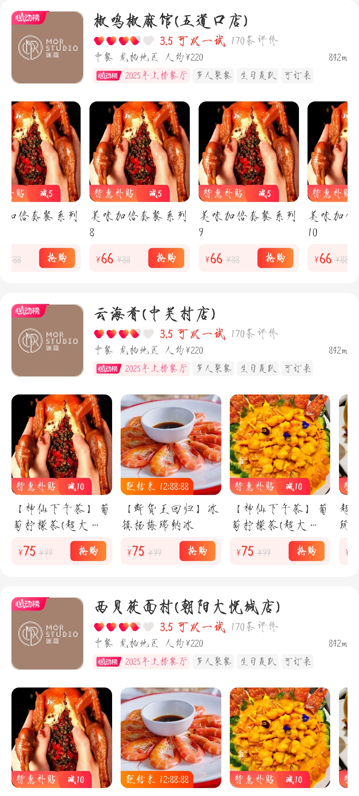

# 项目功能描述说明书

## 功能实现
### 餐厅列表
- App组件作为根容器，scroll-view实现纵向滚动列表，循环渲染RestaurantCard组件展示餐厅信息。
- App.tsx: 餐厅卡片数据源cardDataList，包含餐厅 ID 和名称等基础信息，通过 Props 传递给子组件。
- App.css: 全局容器样式，设置100vw和100vh的视口占比，使用#f5f5f5作为背景色，移除内边距确保列表从顶部开始排列。
### 餐厅卡片组件
- 卡片布局：RestaurantCard组件采用上下分区设计，上半部分展示餐厅基本信息，下半部分展示菜品列表。
- 餐厅信息展示：
    - 左侧显示餐厅 Logo 及角标（如 "2025 年上榜餐厅" 标识）
    - 右侧分四行展示：餐厅名称（文字溢出省略）、评分星级、分类\区域\人均消费等元数据、特色标签
- 菜品滚动展示：
    - 使用横向scroll-view实现菜品列表水平滚动，大量菜品展示(100)
    - 菜品卡片: 图片、标签（补贴\倒计时等）、名称、价格（现价与原价对比）和 "抢购" 按钮
    - 标签类型：补贴+减价组合标签、倒计时标签等，绝对定位实现标签叠加
### 效果图
